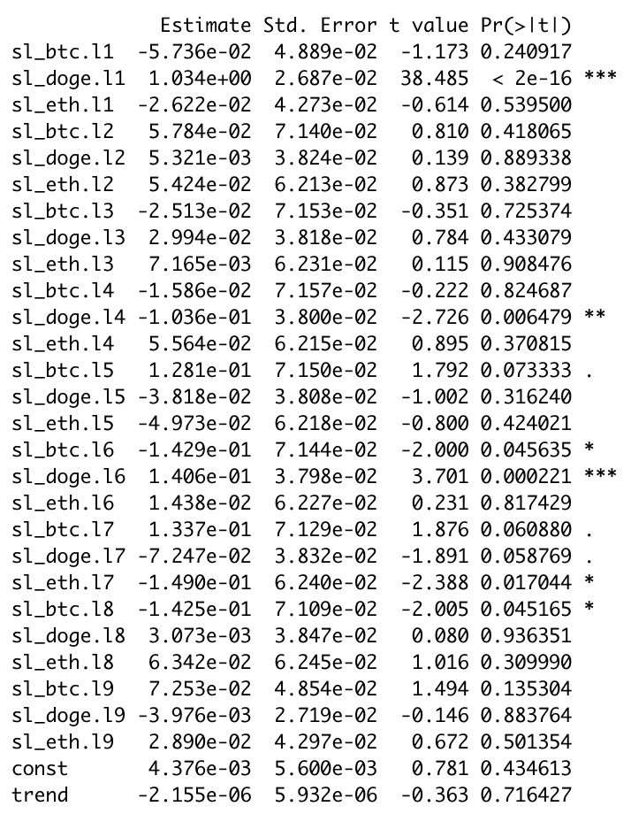
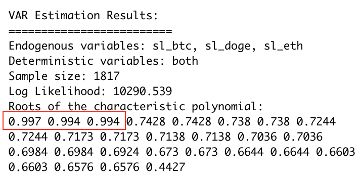

```{r setup, include=FALSE}
knitr::opts_chunk$set(echo = TRUE)
library(tidyverse)
library(vars)
library(lmtest)
library(forecast)


# na 'resolver'. turns na's into previous day's close value

na2lag1 <- function(x) {
  i <- 1
  while (i <= length(x)) {
    if (is.na(x[i])) {
      x[i] <- x[i - 1]
    }
    i <- i + 1
  }
  return(x)
}
```

# Introduction

The vector autoregressive model (VAR) is a time series model that is typically used for the analysis of multivariate time series. Consequently, VAR models are particularly useful in fields where several time series may affect one another. For example, a researcher may be interested in exploring the relationship between several foreign exchange rates over time or the trends of two countries' GDPs. While the fields of economics and finance may be initial fields that come to mind when discussing VAR models, the natural sciences also use VAR models to analyze and forecast things such as rainfall while also considering humidity, temperature, and other factors. 

Like the name suggests, VAR models are an extension of the univariate autoregressive model. Similar to the univariate autoregressive model, each variable's equation includes its own lagged values. However, the VAR model goes a step further and also includes lagged values of other time series in each variable's equation. Including this extra information allows VAR models to often make more accurate predictions than the general AR model, justifying their existence and use. It is worth noting that several related models have been developed over the past few decades. Namely, structural vector autoregressive models, vector error correction models, and structural vector error correction models. While these models are outside the scope of this paper, it is useful to know they attempt to improve the VAR model by accounting for concepts such as cointegration or some type of shock. 

In this paper, we will discuss the form, estimation, diagnostics, and forecasting process of VAR models. To highlight these methods, we have included a brief analysis of three cryptocurrency time series. Additionally, this paper will only deal with the selection and forecasting of stationary VAR models. 


# Methods

### Model

The basic structure of a VAR model is quite similar to that of an AR model, however there are two fundamental differences. The first is that there are multiple equations, one for each item in the vector of time series considered. Secondly, rather than have a time point $x_t$ of a given time series being regressed on its own lags, it is also regressed on the lags of the other time series. The order of the model (number of lags) is typically indicated by the *p* in VAR(*p*).

There are three main forms of VAR models: reduced, recursive, and structural. The reduced form defines each variable in the vector of time series as the function of its own lags and the lags of all other variables, with an error term. The error terms from each equation can theoretically be correlated, *but only within the same time period*. Correlation across equations across different time periods would imply autocorrelated errors within a single time series, which violates the assumptions of the model.

Recursive VAR models are constructed so that the error terms for a variable are uncorrelated to the prior variables' errors. This is done by adding the  preceding variables' current values to the typical VAR equation. 

The structural VAR models are distinguished in that they make assumptions of the "causal structure" of the the data allow shocks to be indentified. These shocks would otherwise be incorporated into error terms in recursive and reduced models.

A reduced VAR(1) model with  three variables can be modeled as such:

\begin{equation}
\begin{aligned}
x_{t,1} = \alpha_1 + \beta_{1,1}x_{t-1,1} +\beta_{1,2}x_{t-1,2} + \beta_{1,3}x_{t-1,3}+\epsilon_{t,1} \\
x_{t,2} = \alpha_2 + \beta_{2,1}x_{t-1,1} +\beta_{2,2}x_{t-1,2} + \beta_{2,3}x_{t-1,3}+\epsilon_{t,2} \\
x_{t,1} = \alpha_3 + \beta_{3,1}x_{t-1,1} +\beta_{3,2}x_{t-1,2} + \beta_{3,3}x_{t-1,3}+\epsilon_{t,3}
\end{aligned}
\end{equation}

We can generalize the previous equations for a VAR(*p*) model with *k* variables using matrix algebra:

\begin{equation}
\begin{bmatrix}x_{1,t} \\ x_{2,t}\\ \vdots \\ x_{k,t}\end{bmatrix} = 
\begin{bmatrix} \alpha_{1}^1 & \alpha_{1}^2 \\ \alpha_{2} & \alpha_{2}^2\\ \vdots & \vdots  \\ \alpha_{k}^1 & \alpha_k^2\end{bmatrix} \begin{bmatrix} 1 \\ t \end{bmatrix}+
\begin{bmatrix}
\beta_{1,1}^1 & \cdots & \beta_{1,k}^1\\
\beta_{2,1}^1 & \cdots & \beta_{2,k}^1\\
\vdots& \ddots& \vdots\\
\beta_{k,1}^1& \cdots & \beta_{k,k}^1
\end{bmatrix}
\begin{bmatrix}x_{t-1,1} \\ x_{t-1,2}\\ \vdots \\ x_{t-1,k}\end{bmatrix}
+ \cdots +
\begin{bmatrix}
\beta_{1,1}^p & \cdots & \beta_{1,k}^p\\
\beta_{2,1}^p & \cdots & \beta_{2,k}^p\\
\vdots& \ddots& \vdots\\
\beta_{k,1}^p & \cdots & \beta_{k,k}^p
\end{bmatrix}
\begin{bmatrix}x_{t-p,1} \\ x_{t-p,2}\\ \vdots \\ x_{t-p,k}\end{bmatrix}
+ \begin{bmatrix}\epsilon_{t,1} \\ \epsilon_{t,2}\\ \vdots \\ \epsilon_{t,k}\end{bmatrix}
\end{equation}

or, abstracting the matrices

\begin{equation}
\bf{x}_{t} =Au + B^1x_{t-1} +...+B^px_{t-p} +\epsilon_t 
\end{equation}

where $\bf{x}_{t}$ is an (k x 1) vector of time series variables, and $\bf{x}_{t-i}$ are the vectors of the time series variables at various lags determined by *p*. $\bf{A}$ is the coefficient matrix on the constant and trend term (both optional) represented in $\bf{u}$. $\bf B^ix_{t-i}$ are the (k x k) coefficient matrices; there are *p* of these matrices dependent on the order of the VAR(p) model. $\bf \epsilon_t$ is the vector of error terms.

### Estimation

VAR models fall into the category of Seemingly Unrelated Regression (SUR) models, which, without diving into too much detail, allows the combination of multivariate systems into a conceptually simpler notation. The VAR case of SUR models is one in which all the explanatory variables (but not the coefficients, importantly) are indentical across equations. While SUR models often use Generalized Least Squares to estimate the equations, in the case of VAR models OLS is theoretically just as efficient at estimating each equation individually.

An extremely important consideration before estimating VAR models, however, is parameter selection and extent. As both variables and lags are added to VAR models, the number of coefficients increases quadratically. For example, a "nine-variable, four-lag VAR has 333 unknown coefficients" (Stock 110).

The coefficients of an estimated VAR model can be interpreted similar to that of an OLS or AR model. If all assumptions are met, asymptotically valid t-tests for significance on individual coefficients may also be constructed in the usual way. Inference on the coefficients is likewise straightforward, where coefficient $\beta_{z,n}^y$ would represent the effect of the lag-y value of the $n^{th}$ variable on the $z^{th}$ variable at time *t* (Figure 2).

### Diagnostics and Lag Length Selection


The diagnostic testing for VAR models is similar to the diagnostic testing for AR models except with a few extra tests to consider.

However, first we will go over the lag length selection process. The question of how many lag terms to include in a VAR model is an important because it plays a substantial role in the quality of forecasts the model will make. The common approach to select this number is to fit VAR(*p*) models with lag lengths from *p* = 0,...,$p_{max}$ and choose the *p* with that minimizes the considered information criteria. Typically, Akaike, Bayesian, Hannan-Quinn, and forecast prediction error information criterion are considered. Model selection criteria for VAR(*p*) models has the form

\begin{equation}
\begin{aligned}
IC(p)=ln|\tilde \sum(p)|+c_T*\varphi(n,p)
\end{aligned}
\end{equation}

where $\tilde \sum(p) = T^-1 \sum^{T}_{t=1} \hat \epsilon_t \hat \epsilon^\prime_t$ represents the residual covariance matrix without a degrees of freedom correction, $c_T$ is a sequence indexed by the sample size T, and $\varphi(n,p)$ is a penalty function to penalize large VAR(*p*) models. Each criterion has its benefits and drawbacks. These are not the focus on this paper, but it is generally best to consider several criteria when determining the optimal lag length selection. 

It is also beneficial to consider running Granger causality tests on several or all of the variables that you are considering including in your VAR model. A variable is said to Granger-cause another variable if the first variable is found to be a useful predictor of the second variable. Essentially, a variable $x_1$ fails to Granger-cause $x_2$ if for all s>0 the MSE of a forecast of $x_{2,t+s}$ based on lags of $x_2$ is the same or less than a forecast of $x_{2,t+s}$ based on lags of $x_2$ and lags of $x_1$. Notably, Granger causality does not say anything about true causality, only about forecasting ability. 


When determining the quality of the fit of a certain VAR model, it is useful to consider the ACF and PACFs of the residuals. Similar to evaluating an AR model, we are looking for ACF and PACF plots that show no autocorrealtion within the residuals. Unlike with the univariate AR models, we must also consider cross-correlation plots. Considering the ACF plots of the residuals for each set of residuals of all of the variables in a VAR model is important in order to observe any cross-correlations between variables indicating that your model might not be capturing the relationship between those variables and time sufficiently. 

To test for heteroscedasticity within errors it is common to use an ARCH-LM test. However, this test relies on a complicated regression that is outside the scope of this paper. Similarly, the technical details of the normality test are also outside the scope of this paper but the gist of it is that researchers should use Jarque-Bera normality tests to test for normality of residuals of either each individual equation or the normality of all the equations' residuals using a variance-covariance matrix for the centered residuals.

It is also wise to test for autocorrelation within the residuals of VAR(*p*) models to avoid standard errors being too small or t-statistics that are too large. To conduct a test for autocorrelation within residuals we can conduct a Portmanteau test of the form

\begin{equation}
\begin{aligned}
Q_h = T \sum_{j = 1}^h tr(\hat{C}_j'\hat{C}_0^{-1}\hat{C}_j\hat{C}_0^{-1}) \quad
\end{aligned}
\end{equation}

where $\hat{C}_i = \frac{1}{T}\sum_{t = i + 1}^T \bf{\hat{u}}_t \bf{\hat{u}}_{t - i}'^\top$ and the test statistics $Q_h$ has an approximate $\chi^2(K^2(h - n^*))$ distribution. $n^*$ refers to the number of non-deterministic terms in the specified VAR(p) model.

To test for the stability of a VAR model coefficients overtime, it is typical to compute an empirical fluctuation processes of type OLS-CUSUM.


### Forecasting 

Forecasting in VAR is somewhat straightforward and similar to typical AR models. A one-step ahead forecast made at time *t+1* can be expressed as

\begin{equation}
\bf{x}_{t+1|t} =Au + B^1x_t +...+B^px_{t-p+1}
\end{equation}

Predicting more than one step ahead is done recursively in what can be referred to as the chain-rule of forecasting. Essentially, the *t+1* forecast value is used to predict the *t+2* value and so on. The *h*-step ahead forecast can be expressed as

\begin{equation}
\bf{x}_{t+h|t} =Au + B^1x_{t+h-1} +...+B^px_{t+h-p}
\end{equation}

As in AR models, the standard errors of the error terms and forecasted values accumulate over time, increasing the forecast confidence interval without bound as *h* increases. 

# Data Example

As mentioned in the introduction, VAR models are commonly used by the field of finance in order to explore the relationships between several time series and to use the extra information provided by multivariate series in forecasting. Consequently, we downloaded three time series of daily closing prices for Doge coin, Bitcoin, and Ethereum for the past 5 years - from 2016-05-26 to 2021-05-25. While cryptocurrnecies never 'close' in the traditional stock exchange sense, closing price typically refers to the price at 11:59PM UTC on any given day. 

{#id .class width=50% height=50%}

Figure 1 shows a plot of each series after they have been scaled and logged to adjust for differences in scale and non-stationary behavior. Running the *VARselect()* command we see that two of the selection criteria, AIC and FPE, suggest a *p* = 9 and the other two criteria, HQ and SC, suggest a *p* = 1. Consequently, we will fit two VAR models with each respective value of *p*. We also run several Granger causality tests to see if any of the series appear to be useful in predicting the other at an order of 1. Unfortunately, we find that the only currency pairing that was significantly predictive was BTC of DOGE coin.

{#id .class width=50% height=50%} {#id .class width=50% height=50%}

The grid of nine plots to the left is the cross correaltion plot for the fit with *p* = 9 and the grid to the right is fit with *p* = 1. Ideally all these plots would look like white noise. However, we notice that for both models the residuals of ETH and BTC seem to show significant autocorrelation at lag 0 as well as the DOGE and BTC residuals. 

Conducting a Asymptotic Portmanteau test, we find that we fail to find significant evidence of autocorrelation in the residuals for the p9 model but we do for the p1 model. Additionally, we conducted a stability test for each fit and found all equations across each model to be relatively stable. Lastly, the fits appear to have normally distributed errors but according to an ARCH Engle's test for residual heteroscedasticity it appears both models contain evidence of heteroscedasticity in their residuals, which is not ideal.

Despite some less-than-ideal diagnostic results, we decided to use the p9 model to forecast some data due to its lack of autocorrelation found during the Asymptotic Portmanteau test and its slightly better-looking stability test plots. 

{#id .class width=50% height=50%}


Additionally, we also collected the most recent closing prices for the cryptocurrencies since we had collected the data on 2021-05-25 and compared the forecasted VAR(9) values to the actual data values for each currency. 

{#id .class width=50% height=50%} {#id .class width=50% height=50%}
{#id .class width=50% height=50%}

The mean percentage difference between the forecasted data and the actual data for BTC, ETH, and DOGE coin is 2.5%, 2.62%, and 3.93% respectively. Since the data has been scaled and logged to such a degree, interpretation of the actual forecasts is difficult. However, we are glad to see our model performing somewhat accurately over a very short term. 

The most interesting cryptocurrency predictions were found in DOGE (see Appendix Figure 3). As the Granger causality test indicated, the pairing between DOGE and BTC was significant. More specifically, the 6th and 8th lags of BTC are negatively associated with DOGE's current price. Again keeping in mind the scaled and logged nature of the variable, we can interpret the coefficient $\hat \beta_{2,1}^6$ which represents the estimated effect of the lag-6 value of BTC ('1') on the DOGE ('2') variable at the current time, as such: a one standard deviation increase in the log price of Bitcoin 6 days ago is associated with a -0.143 standard deviation decrease in the log price of Dogecoin today, not considering of the effects of other lags and variables.

A simpler and much more significant coefficient we can look at is the lag-1 coefficient of DOGE on itself, $\hat \beta_{2,2}^1$. A one SD increase in the log price of Dogecoin yesterday is associated with a 1.03 SD increase in the log price of Dogecoin today, all else held equal.

# Discussion

While the model results mostly indicated significant autoregressive behavior within variables, the lone cross-variable significance found is worth acknowledging. BTC was found to be influential on DOGE, which is not incredibly surprising. BTC, as the premier cryptocurrency, makes sense to have the most influence on market sentiment. One possibility is that following consistent increases in BTC price, DOGE holders sell their stake and buy BTC, the seemingly appreciating cryptocurrency. 

Despite the arguably adequate predictive power of our cryptocurrency VAR model, it is import to acknowledge unmet assumptions that may comprimise the reliability of its results. Firstly, there is the problem of non-stationarity. While logging and standardizing somewhat alleviated the issues of exponential growth and disparate scales, the autocovariance structure of cyptocurrencies may have changed over the time series' observed periods. Likewise, the presence of multiple near-unit roots in the model indicates non-stationarity (Appendix Figure 4), which could require multiple differences to resolve. Second, the Granger causality test is not very supportive of the use of VAR given the weak predictive power outside of the BTC-DOGE link.

Third, there remains the issue of cointegration, where the variables in the VAR model are driven not just by AR behavior and each other, but also a common external causal source. In this case, a basic VAR model would be insufficient. It would be interesting to investigate other models, including the aforementioned Structural VAR (SVAR) for our data which would allow deterministic effects. Vector error correction (VECM) and structural vector error correction models (SVEC) could also be appropriate.

There are a plethora of more models that could be used to model volatile cryptocurrency, including autoregressive conditional heteroscedasticity (ARCH) models, which can address error variance changes over the course of a time series. Overall, however, VAR is a conceptually simple but powerful model that is effective at not only forecasting but also observing the relationship between variables. Impulse responses were one piece of the VAR toolkit we did not address, but involve mapping the effect of a shock to one variable on the others. Though outside the scope of this project, this information would also be very apt for financial modeling.

# References

Pfaff, Bernhard. VAR, SVAR and SVEC Models: Implementation Within R Package vars. Journal of Statistical Software 27(4), 2008. https://cran.r-project.org/web/packages/vars/vignettes/vars.pdf.

PennState Eberly College of Science. Vector autoregressive models VAR(p) models.
https://online.stat.psu.edu/stat510/lesson/11/11.2.

Shumway, Robert H., and David S. Stoffer. Time Series Analysis and Its Applications. Springer Texts in Statistics, Springer International Publishing, 2017, pp. 273–279. https://link.springer.com/content/pdf/10.1007%2F978-3-319-52452-8.pdf.

Stock, James H., and Mark W. Watson. “Vector Autoregressions.” Journal of Economic Perspectives, vol. 15, no. 4, American Economic Association, Nov. 2001, pp. 101–15. Crossref, doi:10.1257/jep.15.4.101.

\newpage

# Appendix

{#id .class width=50% height=50%}

{#id .class width=50% height=50%}

\newpage

# Code Appendix

```{r appendix-setup, eval=FALSE}
knitr::opts_chunk$set(echo = TRUE)
library(tidyverse)
library(vars)
library(lmtest)
library(forecast)

# na 'resolver'. turns na's into previous day's close value
na2lag1 <- function(x) {
  i <- 1
  while (i <= length(x)) {
    if (is.na(x[i])) {
      x[i] <- x[i - 1]
    }
    i <- i + 1
  }
  return(x)
}
```

#### Reading In Data

```{r, eval=FALSE}
# reading in data
btc <- read_csv("BTC-USD.csv")
eth <- read_csv("ETH-USD.csv")
doge <- read_csv("DOGE-USD.csv")
eth <- eth[-1827, ] # matching length
```

#### Plotting the Data

```{r, eval=FALSE}
# creating closing price dataframe
closing_prices <- as.data.frame(cbind(btc$Close, eth$Close, doge$Close))
closing_prices$Date <- btc$Date
colnames(closing_prices) <- c("BTC", "ETH", "DOGE", "Date")

# plotting the 3 time series
plot(closing_prices$Date, closing_prices$BTC, type = "l")
lines(closing_prices$Date, closing_prices$ETH, type = "l", col = "red")
lines(closing_prices$Date, closing_prices$DOGE, type = "l", col = "dark green")
```

#### Scaling the Data and Plotting it 

```{r, eval=FALSE}
# creating scaled data dataframe
btc_scale <- scale(closing_prices$BTC)
doge_scale <- scale(closing_prices$DOGE)
eth_scale <- scale(closing_prices$ETH)

scaled_data <- data.frame(
  Date = closing_prices$Date,
  scaled_bth = btc_scale[, 1],
  scaled_eth = eth_scale[, 1],
  scaled_doge = doge_scale[, 1]
)

# plotting the scaled data
plot(scaled_data$Date, scaled_data$scaled_bth, type = "l")
lines(scaled_data$Date, scaled_data$scaled_eth, type = "l", col = "red")
lines(scaled_data$Date, scaled_data$scaled_doge, type = "l", col = "dark green")
```

#### Scaling, Logging, and Plotting the Data

```{r, eval=FALSE}

# creating scaled log dataframe
Date <- closing_prices$Date
sl_btc <- scale(log((closing_prices$BTC)))[, 1]
sl_doge <- scale(log(as.numeric(closing_prices$DOGE)))[, 1]
sl_eth <- scale(log(as.numeric(closing_prices$ETH)))[, 1]
sl_data <- data.frame(Date, sl_btc, sl_doge, sl_eth)


# plotting scaled log data
plot(sl_data$Date, sl_data$sl_btc, type = "l", main = 'Plot of Scaled and Log Data', xlab = 'Year', ylab = 'Loged and Scaled Price')
lines(sl_data$Date, sl_data$sl_eth, type = "l", col = "red")
lines(sl_data$Date, sl_data$sl_doge, type = "l", col = "dark green")
legend('topleft', legend =c("BTC", "ETH", "DOGE"), fill = c("black","red","dark green") )
```

#### Plotting Differenced Scaled Data 

```{r, eval=FALSE}

# differenced scaled (unlogged) data plot
plot(scaled_data$Date[c(-1, -2)], diff(scaled_data$scaled_bth, 2), type = "l")
lines(scaled_data$Date[c(-1, -2)], diff(scaled_data$scaled_eth, 2), type = "l", col = "red")
lines(scaled_data$Date[c(-1, -2)], diff(scaled_data$scaled_doge, 2), type = "l", col = "dark green")
```

#### Selecting p 

```{r, eval=FALSE}

# varselect for scaled & logged data, determining optimal lag length
slvar <- VARselect(na.omit(sl_data[,-1]), lag.max = 100, type = "both")
slvar$selection
plot(slvar$criteria[1,], type = 'l')
lines(slvar$criteria[2,], type = 'l', col = "red")
```

#### Granger test for causality 

```{r, eval=FALSE}

grangertest(sl_btc ~ sl_doge, data = sl_data, order = 1)

grangertest(sl_btc ~ sl_eth, data = sl_data, order = 1)

grangertest(sl_doge ~ sl_eth, data = sl_data, order = 1)

grangertest(sl_doge ~ sl_btc, data = sl_data, order = 1)

grangertest(sl_eth ~ sl_btc, data = sl_data, order = 1)

grangertest(sl_eth ~ sl_doge, data = sl_data, order = 1)

```

#### Fitting Models

```{r, eval=FALSE}

# removing NAs 
sl_data$sl_btc<-na2lag1(sl_data$sl_btc)
sl_data$sl_doge<-na2lag1(sl_data$sl_doge)
sl_data$sl_eth<-na2lag1(sl_data$sl_eth)


# using results of VARselect to fit two models than compare them
fitvar_p9 <- VAR(sl_data[,-1], p = 9, type = "both")
fitvar_p1 <- VAR(sl_data[,-1], p = 1, type = "both")

summary(fitvar_p9)
summary(fitvar_p1)

```

#### Diagnostic Tests

```{r, eval=FALSE}

# Asymptotic Portmanteau test

# we fail to find evidence of autocorrelation in the residuals of 
# the VAR(9) model at the default of 16 lags,
serial.test(fitvar_p9, lags.pt = 16)


# we find evidence of autocorrelation in the residuals of the VAR(1) model
serial.test(fitvar_p1, lags.pt = 16)


# Breusch-Godfrey test

# same reversal present for the BG test...
serial.test(fitvar_p9,lags.bg = 16, type = 'BG')


serial.test(fitvar_p1,lags.bg = 16, type = 'BG')

```

```{r, eval=FALSE}
# testing the stability of the model
stablity_test_p9 <-stability(fitvar_p9, type = c("OLS-CUSUM"))
stablity_test_p1 <-stability(fitvar_p1, type = c("OLS-CUSUM"))

# the plots look decent
plot(stablity_test_p9)
plot(stablity_test_p1)

```

```{r, eval=FALSE}
# Jarque–Bera test is a goodness-of-fit test of whether sample data 
# have the skewness and kurtosis matching a normal distribution
p9_normal <- normality.test(fitvar_p9)
p1_normal <- normality.test(fitvar_p1)

plot(p9_normal)
plot(p1_normal)


# Portmanteau Q and test for the null hypothesis that the residuals of an model are homoscedastic
arch.test(fitvar_p9)
arch.test(fitvar_p1)
```

#### Residual Plots for Each Fit

```{r, eval=FALSE}
acf(residuals(fitvar_p9))

acf(residuals(fitvar_p1))
```

#### Forecasting

```{r, eval=FALSE}

# need to refit model using slightly differently formatted data 
sl_data_as_ts <- as.ts(sl_data[,-1])
fitvar_p9 <- VAR(sl_data_as_ts, p = 9, type = "both")

forecast(fitvar_p9, h = 12) %>%
  autoplot() + xlab("Year")

fitvar_p1 <- VAR(sl_data_as_ts, p = 1, type = "both")

forecast(fitvar_p1, h = 12) %>%
  autoplot() + xlab("Year") 


```

#### Evaluating Forecast Quality

```{r, eval=FALSE}

# Our data ends on 5-25-2021, so now we will 
# load in the most recent closing prices for all three cryptocurrencies 

new_btc <- read_csv('BTC-USD2.csv')
new_doge <- read_csv('DOGE-USD2.csv')
new_eth <- read_csv('ETH-USD2.csv')


closing_prices2 <- as.data.frame(cbind(new_btc$Close, new_eth$Close, new_doge$Close))
closing_prices2$Date <- new_btc$Date
colnames(closing_prices2) <- c("BTC", "ETH", "DOGE", "Date")


# creating scaled log dataframe
closing_prices_combinded <- rbind(closing_prices, closing_prices2)
Date2 <- closing_prices_combinded$Date
sl_btc2 <- scale(log((closing_prices_combinded$BTC)))[, 1]
sl_doge2 <- scale(log(as.numeric(closing_prices_combinded$DOGE)))[, 1]
sl_eth2 <- scale(log(as.numeric(closing_prices_combinded$ETH)))[, 1]
sl_data2 <- data.frame(Date2, sl_btc2, sl_doge2, sl_eth2)

# truncated the old data we used to keep the data on the same scale 
sl_data2 <- sl_data2[1827:1838,]


sl_data_as_ts2 <- as.ts(sl_data2[,-1])

# we need to get the point forecasts of our p9 model 
p9_data <- forecast(fitvar_p9, h = 12)

p9_data_temp <- as.data.frame(p9_data)

p9_data_temp <- p9_data_temp[,1:3]

# we need to change the format of our data for easier plotting 
sl_data_longer <- pivot_longer(sl_data2, cols = sl_btc2:sl_eth2, names_to = 'Series', values_to = 'Value')
sl_data_longer$Date2 <- rep(1827:1838,times = 1, each = 3)


sl_data_longer$Time <- sl_data_longer$Date2
sl_data_longer$Date2 <- NULL


p9_data_temp$Value <- p9_data_temp$`Point Forecast`
p9_data_temp$`Point Forecast` <- NULL


all_data <- rbind(p9_data_temp, sl_data_longer)
```

```{r, eval=FALSE}
all_data %>%
  filter(Series == 'sl_btc' | Series == 'sl_btc2') %>%
  ggplot(aes(x = Time, y = Value, group = Series, color = Series)) + 
  geom_line() + 
  scale_color_discrete(name  ="Series",
                          breaks=c("sl_btc", "sl_btc2"),
                          labels=c("Forecasted Data", "Actual Data")) + labs(title = 'VAR(9) Model predictions for BTC contrasted with Actual Prices')

all_data %>%
  filter(Series == 'sl_doge' | Series == 'sl_doge2') %>%
  ggplot(aes(x = Time, y = Value, group = Series, color = Series)) + 
  geom_line() + 
  scale_color_discrete(name  ="Series",
                          breaks=c("sl_doge", "sl_doge2"),
                          labels=c("Forecasted Data", "Actual Data")) + labs(title = 'VAR(9) Model predictions for DOGE contrasted with Actual Prices')

all_data %>%
  filter(Series == 'sl_eth' | Series == 'sl_eth2') %>%
  ggplot(aes(x = Time, y = Value, group = Series, color = Series)) + 
  geom_line() + 
  scale_color_discrete(name  ="Series",
                          breaks=c("sl_eth", "sl_eth2"),
                          labels=c("Forecasted Data", "Actual Data")) + labs(title = 'VAR(9) Model predictions for ETH contrasted with Actual Prices')


```

#### Plotting VAR(1) Data and Actual Values 

```{r, eval=FALSE}
# we need to get the point forecasts of our p9 model 

p1_data <- forecast(fitvar_p1, h = 12)


p1_data_temp <- as.data.frame(p1_data)

p1_data_temp <- p1_data_temp[,1:3]


# we need to change the format of our data for easier plotting 


p1_data_temp$Value <- p1_data_temp$`Point Forecast`
p1_data_temp$`Point Forecast` <- NULL


all_data2 <- rbind(p1_data_temp, sl_data_longer)

```

```{r, eval=FALSE}

all_data2 %>%
  filter(Series == 'sl_btc' | Series == 'sl_btc2') %>%
  ggplot(aes(x = Time, y = Value, group = Series, color = Series)) + 
  geom_line() + 
  scale_color_discrete(name  ="Series",
                          breaks=c("sl_btc", "sl_btc2"),
                          labels=c("Forecasted Data", "Actual Data")) + labs(title = 'VAR(1) Model predictions for BTC contrasted with Actual Prices')

all_data2 %>%
  filter(Series == 'sl_doge' | Series == 'sl_doge2') %>%
  ggplot(aes(x = Time, y = Value, group = Series, color = Series)) + 
  geom_line() + 
  scale_color_discrete(name  ="Series",
                          breaks=c("sl_doge", "sl_doge2"),
                          labels=c("Forecasted Data", "Actual Data")) + labs(title = 'VAR(1) Model predictions for DOGE contrasted with Actual Prices')

all_data2 %>%
  filter(Series == 'sl_eth' | Series == 'sl_eth2') %>%
  ggplot(aes(x = Time, y = Value, group = Series, color = Series)) + 
  geom_line() + 
  scale_color_discrete(name  ="Series",
                          breaks=c("sl_eth", "sl_eth2"),
                          labels=c("Forecasted Data", "Actual Data")) + labs(title = 'VAR(1) Model predictions for ETH contrasted with Actual Prices')


```

#### Calcualting the Percentage Differance of the Forecasts for VAR(9)

```{r, eval=FALSE}

# just loading in the above data reformatted for easier use
pct_diff_data <- read_csv('forecast_actual.csv')


btc_means <- rowMeans(pct_diff_data[,c('forecast_btc', 'sl_btc2')], na.rm=TRUE)
eth_means <- rowMeans(pct_diff_data[,c('forecast_eth', 'sl_eth2')], na.rm=TRUE)
doge_means <- rowMeans(pct_diff_data[,c('forecast_doge', 'sl_doge2')], na.rm=TRUE)


#percentage differnce for each cryptocurrency, BTC had the lowest % differnece!
#So kind of looks like BTC was best predicted for the p9 model

mean((abs(pct_diff_data$forecast_btc - pct_diff_data$sl_btc2) / btc_means) * 100)

mean((abs(pct_diff_data$forecast_eth - pct_diff_data$sl_eth2) / eth_means) * 100)

mean((abs(pct_diff_data$forecast_doge - pct_diff_data$sl_doge2) / doge_means) * 100)

```
